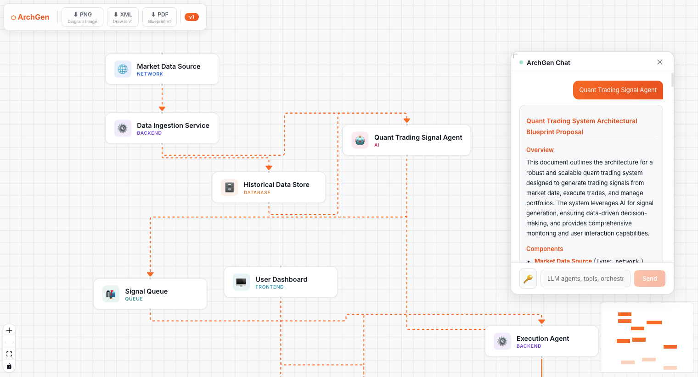

# ArchGen — AI Architecture Diagram Generator

<p align="center">
  
</p>



**ArchGen** is an agentic AI workflow that transforms natural language descriptions into professional architecture diagrams and detailed blueprints.

---

### 🌐 Live App

**[Live App Link to be Updated]**

---

### 🎯 The Goal & Problem

**The Problem:** I want to build complex AI agents and systems, but I always find myself needing the "Big Picture" first. Jumping straight into code without a clear architecture leads to messy logic and integration headaches.

**The Goal:** ArchGen bridges the gap between idea and implementation. It provides a visual and documented "source of truth" before you write a single line of application code.

---

### 🧠 How It Works

ArchGen uses a **Sequential Agentic Workflow** (powered by Google ADK):

1.  **The Architect**: Analyzes your requirement and designs a structured system graph.
2.  **The XML Coder**: Converts that graph into Draw.io XML for professional editing.
3.  **The Blueprint Writer**: Generates a comprehensive Markdown technical proposal.

---

### ✨ Key Features

- **Guided Prompting**: Start quickly with templates (Full Architecture vs. Agent Workflow) and suggestion chips.
- **Sequential Agent Workflow**: A multi-agent pipeline (Architect → XML Coder → Blueprint Writer) ensures technical depth.
- **Bring Your Own Key (BYOK)**: Securely use your own Gemini API quota via a session-based key input.
- **Interactive UI**: A resizable and draggable floating chat panel that stays out of the way of your design.
- **Smart Canvas**: Powered by React Flow with snap-to-grid, auto-layout (Dagre), and movable nodes.
- **Multi-Format Export**:
  - 🖼️ **PNG**: High-resolution image of your diagram.
  - 💾 **XML**: Uncompressed Draw.io compatible file for further manual editing.
  - 📄 **PDF**: Styled, professional technical blueprint ready for sharing.
- **Version History**: Automatically tracks every generation as `v1`, `v2`, etc., so you never lose a design.
- **Privacy First**: Your API keys are stored only in your browser's local storage—never on our servers.

---

### 🚀 Local Setup & Authentication

ArchGen supports two ways to run locally: **Google AI Studio (API Key)** or **Google Cloud SDK (ADC)**.

#### 1. Backend Setup

First, ensure you have [uv](https://github.com/astral-sh/uv) installed.

```bash
# Clone the repository
git clone https://github.com/yeojustin/Archgen-Agentic-Architecture-Diagram-Generator.git
cd architecture-diagram-workflow

# Install Python dependencies
uv sync
```

#### 2. Configure Authentication

Choose **one** of the following methods:

**Method A: Google AI Studio (Fastest)**

1.  Get an API Key from [Google AI Studio](https://aistudio.google.com/app/apikey).
2.  Create a `.env` file in `create_arch_agent/`:
    ```env
    GOOGLE_API_KEY=your_api_key_here
    ```

**Method B: Google Cloud SDK (Vertex AI)**

1.  Install the [Google Cloud SDK](https://cloud.google.com/sdk/docs/install).
2.  Authenticate with Application Default Credentials (ADC):
    ```bash
    gcloud auth application-default login
    gcloud config set project your-project-id
    ```
3.  Ensure your `.env` is empty or does not contain `GOOGLE_API_KEY`.

#### 3. Run the API

```bash
uv run uvicorn api:app --reload --port 8001
```

#### 4. Frontend Setup

```bash
cd frontend
npm install
npm run dev
```

Open [http://localhost:5173](http://localhost:5173).

---

### 🛠️ Smart Local Dev UI

When running on `localhost`, ArchGen detects your development environment and provides a **"🛠️ Local Dev: Use System Default"** button on the start screen.

- If you configured **Method A**, it will use the key in your `.env`.
- If you configured **Method B**, it will use your active `gcloud` credentials.

**In production, this button is hidden, and users are required to enter their own Gemini API Key for security.**

### 👨‍💻 Author

**Yeo Justin**

Built with **FastAPI**, **React Flow**, and **Google Gemini**.
